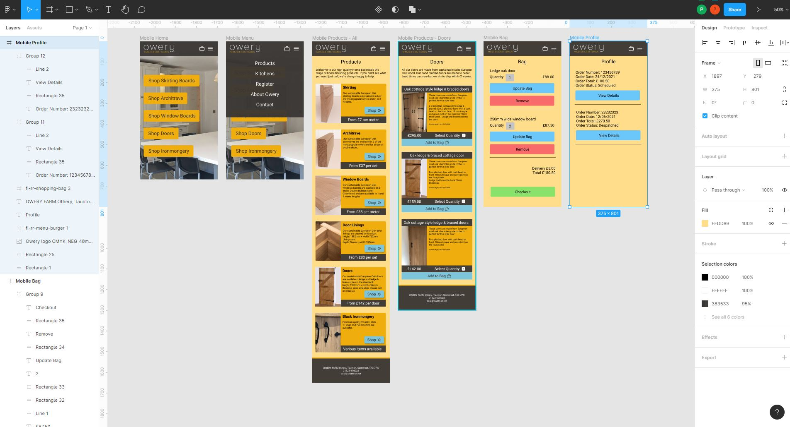

# Owery Joinery

Owery have designed and hand-crafted kitchens, furniture, doors, windows for decades, however through the pandemic thier customers have been increasingly asking them to create home finishing products, skirting, architrave etc. This led them to opening their own online eBay shop fronted by their own static website.

>
> The purpose of this project was to create a functional e-commerce site to replace the current static site.
>

The live project has been deployed to https://owery-joinery.herokuapp.com/

# User Experience (UX)

## User Stories

Working with the owner of Owery Joinery the following personas and user stories have been identified:

>
> First Time Visitor
>

- As a first time visitor to the Owery website, I want to be able to…
 - View a list of all products. So that I can select something to buy.
 - View a list of specific products of my choosing based thier category. So that I can select a particular category of product from a specific list to buy.
 - View a list of specific products of my choosing based thier category and style. So that I can select something from a specific list, where it is easy to compare like for like, to buy.
 - View the details of a product. So that I can understand the details, price and dimensions of a product and also see and image of the product.
 - Sort the view of products by price low to high. So that I can make an informed purchased based on price.
 - Sort the view of products by price high to low. So that I can make an informed purchased based on price.
 - Easily register for an account. So that I can have a personalised account to view my profile.
 - Receive and email once I have registered to verify my account was set up.
 - Easily view the value of my shopping bag anywhere on the website. So that I can understand how much I have selected.
 - Easily view a summary of what's in my shopping bag, including all prices such as delivery and grand total price before I purchase. So that I can see how much I will be spending.
 - Check out and purchase my items without having to log in. So that I can convienietly purchase items quickly.
 - Receive confirmation of an order via email. So that I can easily reference my order.
 - Easily view the contact details for the company. So I can contact Owery about my orders or requirements.

>
> Registered Users
>
- As someone who is registered with the Owery website, I want to be able to…
 - Be able to effortlessly log in to the site. So that I can to access my profile to view my orders.
 - Be able to effortlessly log out of the site,to keep my account secure.
 - Easily recover my password if I forget it. So that I can recover my access to my profile.
 - Have a personalised profile so that I can view my order history.
 - Checkout and add for the order to be added to my profile. So that I can review my purchases at a later date.
 - Track the status of my order. So that I can check the progress or my order.
    
>
> Administrator
>
- As a staff member of Owery, I want to be able to...
 - Add new products. So that I can add new items to the product catalogue myself.
 - Amend current products details. So that I can change products in the catalogue myself.
 - Remove prodcuts from the catalogue. So that I can keep the product catalogue current.
 - Set the job status of an order based on business processes. So that the customer and workshop can see the work schedule and progress.
 - Print off an order. So that I can pass this to the workshop to progress the order.

# Wireframing

 

 

Goodle Ads information reports that the current Owery website's trafiic is almost 70% mobile devices of all visits. This informed the design and therefore wireframes to be built around a mobile experience and this would scale to accomodate desktop.

The wireframes can be accessed here https://www.figma.com/file/PLCjxfbqNyHkBnTBQhETnF/Owery?node-id=3%3A109

# Architecture

## Framework

# Future Improvements
- Print button captures the whole window. This could be made much neater
- Search is very crude. Would be better to implement a third party such as Haystack

# Acknowledgements

# Testing
## HTML
All pages have been tested through https://validator.w3.org/ without issue

## Accepted Errors
Class 'Xxxxxx' has no 'objects' member pylint(no-member)

