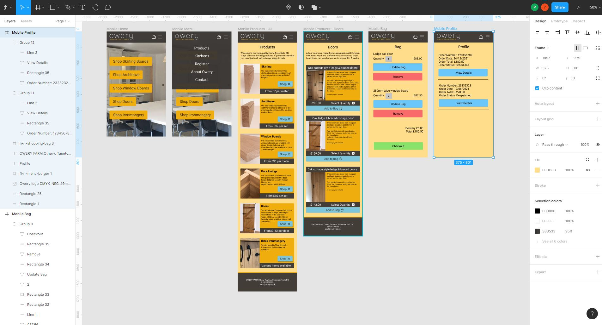
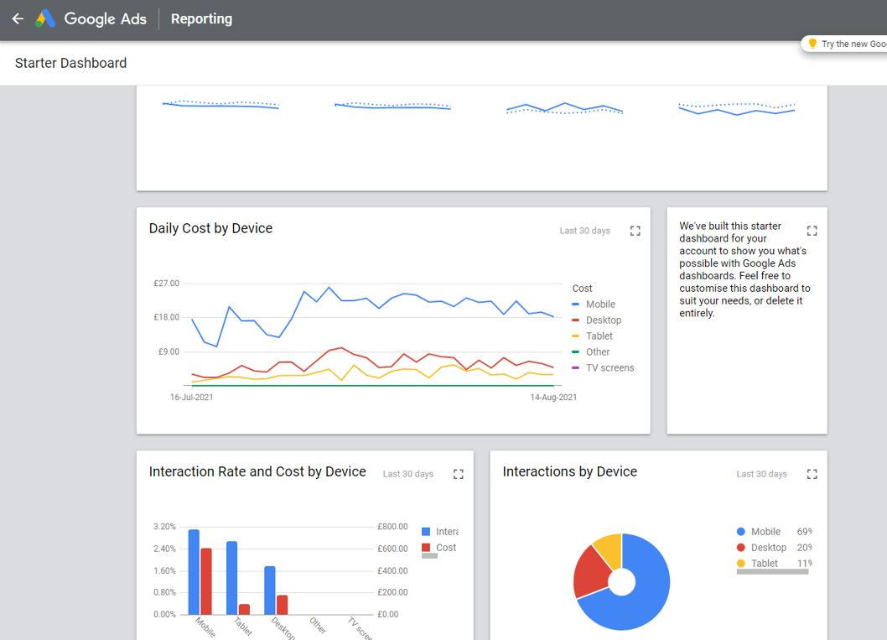
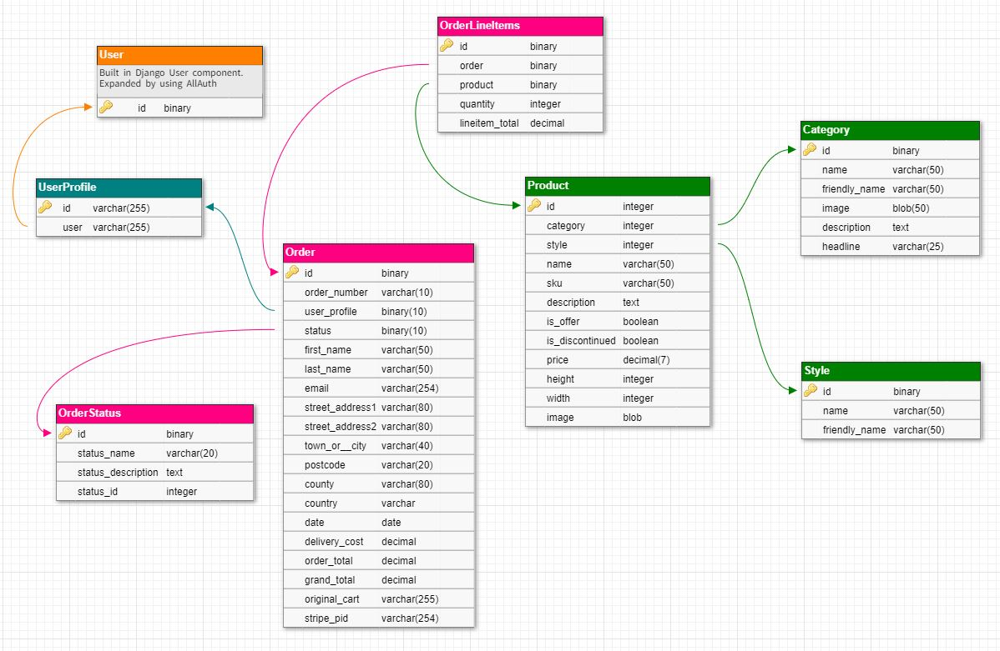

# Owery Joinery

Owery have designed and hand-crafted kitchens, furniture, doors, windows for decades, however through the pandemic their customers have been increasingly asking them to create home finishing products, skirting, architrave etc. This led them to opening their own online eBay shop fronted by their own static website.

>
> The purpose of this project was to create a functional e-commerce site to replace the current static site.
>

The live project has been deployed to https://owery-joinery.herokuapp.com/

# User Experience (UX)

## User Stories

Working with the owner of Owery Joinery the following personas and user stories have been identified:

>
> First Time Visitor
>

- As a first time visitor to the Owery website, I want to be able to…
 - View a list of products. So that I can select something to buy.
 - View a list of specific products of my choosing based their category. So that I can select a particular category of product from a specific list to buy.
 - View a list of specific products of my choosing based their category and style. So that I can select something from a specific list, where it is easy to compare like for like, to buy.
 - View the details of a product. So that I can understand the details, price and dimensions of a product and also see and image of the product.
 - See if there are any special offers. So that I can make an informed purchased based on price.
 - Sort the view of products by price low to high. So that I can make an informed purchased based on price.
 - Sort the view of products by price high to low. So that I can make an informed purchased based on price.
 - Easily register for an account. So that I can have a personalised account to view my profile.
 - Receive and email once I have registered to verify my account was set up.
 - Easily view the value of my shopping cart anywhere on the website. So that I can understand how much I have selected.
 - Easily view a summary of what's in my shopping cart, including all prices such as delivery and grand total price before I purchase. So that I can see how much I will be spending.
 - Check out and purchase my items without having to log in. So that I can conveniently purchase items quickly.
 - Receive confirmation of an order via email. So that I can easily reference my order.
 - Easily view the contact details for the company. So I can contact Owery about my orders or requirements.

>
> Registered Users
>
- As someone who is registered with the Owery website, I want to be able to…
 - Be able to effortlessly log in to the site. So that I can to access my profile to view my orders.
 - Be able to effortlessly log out of the site, to keep my account secure.
 - Easily recover my password if I forget it. So that I can recover my access to my profile.
 - Have a personalised profile so that I can view my order history.
 - Checkout and add for the order to be added to my profile. So that I can review my purchases at a later date.
 - Track the status of my order. So that I can check the progress or my order.
    
>
> Business Owner
>
- As a superuser of Owery, I want to be able to...
 - Add new products. So that I can add new items to the product catalogue myself.
 - Amend current products details. So that I can change products in the catalogue myself.
 - Remove products from the catalogue. So that I can keep the product catalogue current.
 - Set a product to discontinued. So that I can keep the product catalogue current without deleting the product.
 - Set a product to on offer. So I can highlight products where the price has been reduced.
 - Set the job status of an order based on business processes. So that the customer and workshop can see the work schedule and progress.
 - Print off an order. So that I can pass this to the workshop to progress the order.

>
> Workshop Worker
>
- As a workshop worker, I want to be able to...
 - View all orders of a specific status so I can see my workload
 - Change the status of an order, to pass the order to the next business process step

# Wireframing

 

 

Google Ads information reports that the current Owery website's traffic is almost 70% mobile devices. This informed the design and therefore wireframes to be built around a mobile experience and this would scale to accommodate desktop.

The wireframes can be accessed here https://www.figma.com/file/PLCjxfbqNyHkBnTBQhETnF/Owery?node-id=3%3A109

# Architecture

## Database

The Owery Joinery website is run on a relational database.

For this project the Heroku PostgreSQL add-on was used.

## Application

The Django framework provided the application structure that the website was built on to enable an MVC design pattern approach to the application.

### IAM

One of the great advantages of Django is the Ideantity and Access Management capability that it come with out of the box. This was extended bu utilising the Allauth app.

### Static File Delivery

Amazon Web Services was used to facilitate the delivery of application'sStatic content. An S3 Bucket was configured for this purpose.

### Email

A Gmail account has been configured to facilitate the ability to send emails

# Testing

## User Story Testing

>
> As a first time visitor to the Owery website, I want to be able to…
>
- View a list of products. So that I can select something to buy.
    - Upon navigating to the website the user is presented with a clean site containing imagery and text that indicates that this is a site that sells wood crafted products.
    - The 6 categories that contain the products each have a card containing an image with a shop now button. This highlights what type of products are available.
 - View a list of specific products of my choosing based their category. So that I can select a particular category of product from a specific list to buy.
    - The categry cards on the home page make it easy to navingate to product list filtered to the category speified.
    - On the top navigation there is also a menu item to Products. When this is click the list of categories is also viewed.
 - View a list of specific products of my choosing based their category and style. So that I can select something from a specific list, where it is easy to compare like for like.
    - On any product page there is a filter and sort component.
    - The customer can specifically tailor a search to their requirements.
 - View the details of a product. So that I can understand the details, price and dimensions of a product and also see and image of the product.
    - Eack product when listed has some details available to view withough needing to look at further details.
    - However each product also has an obvious View Details button. When clicked this takes the customer to a dedicated product details page that contains the items specific details.
 - See if there are any special offers. So that I can make an informed purchased based on price.
    - Any items that are on special offer highlight this by stating that it is a Special Offer! and to View Details in a red button that is distinctive from other products not on offer.
 - Sort the view of products by price low to high. So that I can make an informed purchased based on price.
    - All pages showing lists of product can be order on price of which an option is low to high.
 - Sort the view of products by price high to low. So that I can make an informed purchased based on price.
     - All pages showing lists of product can be order on price of which an option is high to low.
 - Easily register for an account. So that I can have a personalised account to view my profile.
    - If the customer wishes to create an account by clicking the Account item on the menu they are presented with an option to register.
    - The sign in process is very simple.
 - Receive and email once I have registered to verify my account was set up.
    - An emal is sent to the newly registered customer so they can be assured the account is set up correctly.
 - Easily view the value of my shopping cart anywhere on the website. So that I can understand how much I have selected.
    - The shopping cart icon is displayed on the navigation bar at all time including on a mobile device. The icon give a running total of items in the cart. Clicking on the cart shows a full breakdown of what is in the cart. This includes the cost of item and then a total cost.
    - A sticky navigation bar ensures the shopping cary icon is accesible even when scrolling down a page.
 - Easily view a summary of what's in my shopping cart, including all prices such as delivery and grand total price before I purchase. So that I can see how much I will be spending.
    - The shopping cart icon is displayed on the navigation bar at all time including on a mobile device. The icon give a running total of items in the cart. Clicking on the cart shows a full breakdown of what is in the cart. This includes the cost of item and then a total cost.
    - A sticky navigation bar ensures the shopping cary icon is accesible even when scrolling down a page.
 - Check out and purchase my items without having to log in. So that I can conveniently purchase items quickly.
    - The application is configured so a customer does not need to register with the website
 - Receive confirmation of an order via email. So that I can easily reference my order.
    - Once an order is complete they are directed to a confirmation pages outlining the details of their order and the order number. An email is also sent to the email address they provided.
 - Easily view the contact details for the company. So I can contact Owery about my orders or requirements.
    - On the navigation bat there is a menu item clls contact. Clicking this navigates the customer a page that displays the vaious way in which the business can be contacted.

>
> As someone who is registered with the Owery website, I want to be able to…
>
 - Be able to effortlessly log in to the site. So that I can to access my profile to view my orders.
    - When a user visits the site by clicking Accounts on the navigation bar they are presented with the option to login
 - Be able to effortlessly log out of the site, to keep my account secure.
    - When the user wishes to log out of the site they can again click on the Accounts item in the menu and then select Logout
 - Easily recover my password if I forget it. So that I can recover my access to my profile.
 - Have a personalised profile so that I can view my order history.
 - Checkout and add for the order to be added to my profile. So that I can review my purchases at a later date.
 - Track the status of my order. So that I can check the progress or my order.
    
>
> Business Owner
>
- As a superuser of Owery, I want to be able to...
 - Add new products. So that I can add new items to the product catalogue myself.
 - Amend current products details. So that I can change products in the catalogue myself.
 - Remove products from the catalogue. So that I can keep the product catalogue current.
 - Set a product to discontinued. So that I can keep the product catalogue current without deleting the product.
 - Set a product to on offer. So I can highlight products where the price has been reduced.
 - Set the job status of an order based on business processes. So that the customer and workshop can see the work schedule and progress.
 - Print off an order. So that I can pass this to the workshop to progress the order.

>
> Workshop Worker
>
- As a workshop worker, I want to be able to...
 - View all orders of a specific status so I can see my workload
 - Change the status of an order, to pass the order to the next business process step

## Automated URL Testing

Django SimpleTestCase was used to automate the testing of the Django URLS used in this application.

## Functional Testing

The remained of the functional testing was carried out manually.

The was done extensively and throught the build to ensure that the funtionality met the expected outcomes.
The testing sheet can be view here [Funtional Testing](Testing.xlsx)

## HTML
All pages have been tested through https://validator.w3.org/ without issue

## Python
No errors highlighted through http://pep8online.com/

# Deployment

## To contribute to the project

- Navigate to the Owery Joinery repository page in GitHub https://github.com/PaulWheatcroft/owery-joinery
- In the top right corner click Fork
- This creates a copy in your GitHub repository
- From here you could open in Gitpod or make changes directly in GitHub. Once completed click New Push Request to submit your changes to be merged with the master branch

## Clone and Run Locally

You can find the clone string for the repository in Code button above the project’s files. Most IDE applications have a GUI interface for cloning a GitHub repository from this string.

Alternatively the repository can be cloned from the terminal of your IDE
- Open the terminal
- Change the current working directory to the location where you want the cloned directory
- Type git clone, and then paste the URL you copied earlier. git clone https://github.com/YOUR-USERNAME/YOUR-REPOSITORY
- Press Enter to create the local clone
Once the clone has completed (through either method) you should see a requirements.txt file in the route of the directory.
- In the terminal run pip install -r requirements.txt

The inbuilt Django sqlite3 database will run as a default until you reconfigure this once deployed to Heroku.

It’s advisable to set up the DJANGO_SECRET_KEY as an environment variable rather than leave it exposed in settings.py.

## Stripe

You will need to configure your payment service provider. This project has been set up using Stripe and that will have installed as part of requirements.txt. This project has used the following environment variables to store the keys necessary to run Stripe and make use of their webhook capability. Further documentation of

To set up an account got to https://stripe.com/
- Click start now
- Create your stripe account
- Log in and click on Developers
- Click on API Keys
- •Create two following variables both in settings.py and the same two variable names in your environment variables.
    - STRIPE_PUBLIC_KEY
    - STRIPE_SECRET_KEY
- Store the Stripe Publishable key in STRIPE_PUBLIC_KEY in the environment variables and link this to your variable in settings.py: STRIPE_PUBLIC_KEY = os.getenv('STRIPE_PUBLIC_KEY', '') While strictly speaking this isn’t necessary as the key is public it’s still good practice.
- Store the Stripe Secret key in STRIPE_SECRET_KEY in the environment variables and link this to your variable in settings.py: STRIPE_SECRET_KEY = os.getenv('STRIPE_SECRET_KEY', '')
- Now click on Webhooks in Stripe
- Click Add an endpoint
- When you have configured the endpoint get the Signing secret and store this in another variable STRIPE_WH_SECRET. Again create an environment variable to store the key and link this to the variable in settings.py: STRIPE_WH_SECRET = os.getenv('STRIPE_WH_SECRET', '')

The application has been configured for the UK market. Also in settings.py add the following STRIPE_CURRENCY = 'gbp'

At this point content delivery does not need to be configured as this will be served locally through the standard Django file structure.
You should now be able to run the website from your local environment.

# Deploying to Heroku

- To deploy to Heroku https://www.heroku.com/
- Log in with your account
- Select New
- Then Create new app
- Give your app a unique name and choose your local region
- Then click Create app

Once created for the following steps you will need to have access to Settings and to Reveal Config Vars sectin of your app

## Postgres

This project has been configured using the Heroku Postgres add-on. If you plan on also using this add-on…
- Go to the resources tab in Heroku.
- In the Add-ons search bar look for Heroku Postgres and then click on it to select it
- Choose the Hobby Dev-Free option in plans.
- Click submit order form.

By clicking on the add-on when displayed on the Resources page you will be taken to the datastores page for the database. Click on settings then View Credentials to get the URI path that will be added to the DATABASE_URL variable (see below

## AWS S3 Bucket

An AWS S3 Bucket is used to store the projects static files. Because of how Django works you will also need to configure external storage when deploying to Heroku. To use AWS
- Sign up for an AWS account at https://portal.aws.amazon.com/
- Unless otherwise set this up as a personal account
- Navigate to the AWS Management Console as Root user
- Search and click on S3
- Create a bucket
- Give your bucket a name and choose a region based on your geographical requirements
- Uncheck Block all public access to enable public access
- Acknowledge the current settings
- Click to create the bucket
- Open the bucket you created
- Select Properties tab and turn on static website hosting (bottom of the page)
    - Edit
    - Enable
    - Set Index document to index.html
    - Set Error document to error.html
    - Save changes
- Copy the Amazon Resource Name (ARN)
- Click on the Permissions tab and navigate to Cross-origin resource sharing (CORS) and add the following
[
    {
        "AllowedHeaders": [
            "Authorization"
        ],
        "AllowedMethods": [
            "GET"
        ],
        "AllowedOrigins": [
            "*"
        ],
        "ExposeHeaders": []
    }
]
- In the Bucket Policy click Edit then Policy Generator
    - This open a separate window
- Step 1: is S3 Bucket Policy
- Step 2: add the following settings:
    - Effect: Allow
    - Principal: *
    - Actions: GetObject
    - ARN: The Amazon Resource Name (ARN)
- Click on Add Statement.
- Click on Generate Policy
- Copy the policy from the popup that appears
- Paste the generated policy into the Bucket Policy
- Add '/*' at the end of the Resource key, and save.
- Navigate to the Access control list (ACL) and select List next to Everyone

## AWS IAM

- Search and click on IAM
- Staring on the left of the screen navigate to User Groups
- Create group
- Give your group a name and click create group
- Again on the left of the navigate Policies
    - Create New Policy
    - JSON tab
    - Import Managed Policy and search for S3
    - Select AmazonS3FullAccess and click Import
- Within "Resource" replace * with your [ARN address and ARN address/]
"Resource": [
    "ARN",
    "ARN/*"
]

- Click Next: Tags
- Click Next: Review and provide a name
- Click create policy
- Back on the left-hand side go to User Groups
    - Open your group
    - Permissions
    - Add Permissions
    - Attach Policies
    - Search for your policy and add it
- Back on the left-hand side click Users
    - Add user
    - Add a user name
    - Select Access key - Programmatic access
    - Click Next
    - Select your user group
    - Click Next: Tags then Next: Review then Create User
    - IMPORTANT THIS IS THE ONLY TIME YOU CAN COMPLETE THIS STEP. Download tHE Download.CSV which contains the information you need for the variables AWS_ACCESS_KEY_ID and AWS_SECRET_ACCESS_KEY. Vreate both of these environment variables.
You can now configure the following in settings.py
AWS_STORAGE_BUCKET_NAME = 'your bucket name'
AWS_S3_REGION_NAME = ‘your region’
AWS_ACCESS_KEY_ID = os.environ.get('AWS_ACCESS_KEY_ID')
AWS_SECRET_ACCESS_KEY = os.environ.get('AWS_SECRET_ACCESS_KEY')
AWS_S3_CUSTOM_DOMAIN = f'{AWS_STORAGE_BUCKET_NAME}.s3.amazonaws.com'

# Static and media files
STATICFILES_STORAGE = 'custom_storages.StaticStorage'
STATICFILES_LOCATION = 'static'
DEFAULT_FILE_STORAGE = 'custom_storages.MediaStorage'
MEDIAFILES_LOCATION = 'media'

# Override static and media URLs in production
STATIC_URL = f'https://{AWS_S3_CUSTOM_DOMAIN}/{STATICFILES_LOCATION}/'
MEDIA_URL = f'https://{AWS_S3_CUSTOM_DOMAIN}/{MEDIAFILES_LOCATION}/'

# Gmail

Email will print to the console unless you set up your own email account.
EMAIL_BACKEND = 'django.core.mail.backends.console.EmailBackend'
DEFAULT_FROM_EMAIL = 'your.email@example.com'

For this project gmail was used. To use Gmail log in to your account and go to
- All Settings
- Other Google Account settings
- Security (new tab opens)
- Ensure the 2 Step Verification is on
- Now click on App Password and log in
- Set App to Mail
- Device to Other and name it Django
- A 16-digit number will be generated. Copy this and create the following environment variables

EMAIL_HOST_PASS *with the 16-digit code*
EMAIL_HOST_USER *your Gmail account*
DEFAULT_FROM_EMAIL *your applications email address*

The following can now be configured in settings.py

EMAIL_BACKEND = 'django.core.mail.backends.smtp.EmailBackend'
EMAIL_USE_TLS = True
EMAIL_PORT = 587
EMAIL_HOST = 'smtp.gmail.com'
EMAIL_HOST_USER = os.environ.get('EMAIL_HOST_USER')
EMAIL_HOST_PASSWORD = os.environ.get('EMAIL_HOST_PASS')
DEFAULT_FROM_EMAIL = os.environ.get('EMAIL_HOST_USER')

## Heroku Config Vars

To recap the Heroku app’s Config Vars should be

DJANGO_SECRET_KEY
STRIPE_PUBLIC_KEY
STRIPE_SECRET_KEY
STRIPE_WH_SECRET
AWS_ACCESS_KEY_ID
AWS_SECRET_ACCESS_KEY
USE_AWS
DATABASE_URL
EMAIL_HOST_PASS
EMAIL_HOST_USER
DEFAULT_FROM_EMAIL

You can now add

USE_AWS = True
DISABLE_COLLECTSTATIC = 0

# Deploy

You can now deploy the application from your GitHub repository. In Heroku
- Deploy and click on Connect to GitHub
- Authenticate to your GitHub repositories and select the correct GitHub repository for this project.
- Click on Deploy Branch to make the application available publicly through Heroku

This will take serveral minutes as Heroku installs the components outlined in requirements.txt. Once you you can open the app.

# Bugs
- When partway down a product page adding an item to the cart jupms you back to the top of the page. This is a limitation of the way Python and Django work. Using JavaScript would be a better experience.

# Future Improvements
- Profiles to store addresses
- Implement social media login
- Print button captures the whole window. This could be made much neater
- Search is very crude. Would be better to implement a third party such as Haystack

# Acknowledgements
Massive thanks to my Mentor Adegbenga Adeye for his professional view throughout the project and pushing me to to better :-)

Also a huge thanks to the tutors a Code Institute for being there when I needed them and for them being able to always point me in the right direction!

Thanks to https://www.goranstimac.com/ for his video tutorial on setting up Bootstrap 5 toasts https://www.goranstimac.com/blog/2021/07/how-to-add-bootstrap-5-toast-on-page-load/

